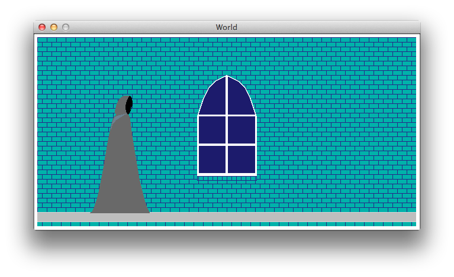

# FP7-webpage LambdaVania

##Authors
Wesley Nuzzo

David Benoit

##Overview
LambdaVania is a 2D sidescroller game, in the vein of the Metroidvania/Igavania style of games. The music for the game, and to some extent the level design, is procedurally generated (level layout is currently one-dimensional).

##Screenshot


##Concepts Demonstrated

* **Higher order procedures** such as map and foldl/foldr to convert lists of notes into rsounds, and consolidate multiple rsounds into a single rsound.
	* Map and foldl/foldr are also used to implement level graphics via a tiling system.
* **Abstraction** of sounds as musical notes.
	* There is an **abstraction barrier** between the graphics library and the actual game code, so that the means by which the graphics are loaded/produced doesn't necessarily break the game code.

##External Technology and Libraries

Libraries used:
* rsound (https://docs.racket-lang.org/rsound/index.html)
	* Used for actually representing and playing the sounds generated by the music generator.
* 2htdp (https://docs.racket-lang.org/teachpack/2htdpimage.html and https://docs.racket-lang.org/teachpack/2htdpuniverse.html)
	* Used to implement animation and interaction, i.e. the video game itself.
* racket/gui (https://docs.racket-lang.org/gui/)
	* Used in a variety of different ways as part of the process by which the sprites and level tiles were created.
	* In particular, the draw library (https://docs.racket-lang.org/draw/index.html) allows, well, drawing.

External technology:
* GIMP (https://www.gimp.org/) to make minor edits to certain completed graphics.

##Favorite Scheme Expressions

####Wesley
The following function is used to create the level background by tiling a single image. What's cool about this to me is that it uses the accumulate syntax to create the graphics in a similar way to the fashion that we normally use it to construct lists. It's an interesting demonstration of exactly the kind of power that Racket's higher order procedures actually have.
```racket
(define (tile image x y)
  ;; Generate the rows
  (let ([row (foldl (lambda (i out) (overlay/xy out i 0 image))
                    empty-image
                    (map (lambda (i) (* i (image-width image))) (range x)))])
    ;; Generate the entire image based on the rows
    (foldl (lambda (i out) (overlay/xy out 0 i row))
           empty-image
           (map (lambda (i) (* i (image-height image)))
                (range y)))))
```

####David

While generating the psuedo-random audio sequences, the program uses symbolic music theory objects rather than rsounds during the computation process.  This is both for performance and programming efficiency.  The base unit is a music note. Notes are organized into measures, which are organized into staff parts, which are organized on an ensemble staff.  The resulting ensemble staff is an object containing lists of lists of lists of note objects.

My favorite section of code in this project is this series of abstractions of map and foldl expressions, which builds an ensemble staff into a single playable rsound.  

```racket
;; Convert an ensemble-staff object into an rsound
(define (e-staff->rsound staff)
  (rs-overlay* (map staff-part->rsound (e-staff->partlist staff))))
  
;; Convert a staff-part into an rsound
(define (staff-part->rsound staff-part)
 (if (staff-part? staff-part)
     (measure->rsound
      (append-measure*
       (staff-part->measurelist staff-part))
      (instrument->proc (staff-part->instrument staff-part)))
     (raise-type-error 'staff-part->instrument "StaffPart" staff-part)))
     
;; Take a measure and a procedure that converts notes to rsounds
;; and apply the procedure to all notes in the measure
(define (measure->rsound measure note-to-rsound-proc)
  (cond ((and (measure? measure) (procedure? note-to-rsound-proc))
           (rs-append* (map (lambda (x) 
                              (if (harmony? x)
                                (harmony->rsound x  note-to-rsound-proc)
                                (note->rsound x note-to-rsound-proc)))
                            (measure->notelist measure))))
         (else
          (if (procedure? note-to-rsound-proc)
             (raise-type-error 'arg1 "Measure" measure)
             (raise-type-error 'arg2 "procedure" note-to-rsound-proc)))))

;; Take a note object and a procedure which can turn
;; the note into an rsound.  Call the procedure with
;; the note object as an argument
(define (note->rsound note note-to-rsound-proc)
  (cond ((and (note? note) (procedure? note-to-rsound-proc))
           (rs-filter (note-to-rsound-proc note) reverb))
         (else
          (if (procedure? note-to-rsound-proc)
             (raise-type-error 'arg1 "Note" note)
             ((raise-type-error 'arg2 "procedure" note-to-rsound-proc))))))


```
All of the previous append-{item} and append-{item}* functions are implemented by combining append with foldl in the same manner as the following example:
```racket
;; Concatenate two measure objects
(define (append-measure m1 m2)
  (cond ((and (measure? m1) (measure? m2))
         (make-measure (append (measure->notelist m1)
                              (measure->notelist m2))))
         (else
           (if (measure? m1)
             (raise-type-error 'arg1 "Measure" m1)
             (raise-type-error 'arg2 "Measure" m1)))))

;; Concatenate a list of measure objects
(define (append-measure* measurelist)
  (foldl (lambda (x y)
           (if (eq? y '())
               x
                (append-measure x y))) '() measurelist))
```

##Additional Remarks

<!-- Anything else you want to say in your report. Can rename or remove this section. -->

Procedural Generation Specifics:
* Audio
	* Harmonic progressions are chosen psuedo-randomly from a list of pre-defined progressions
	* Notes are chosen psuedo-randomly given the current harmony, key, and the instrument's range
	* Rhythyms are determined by randomly and recursively subdividing measures by powers of two, up to a recursion depth of 5. 
	* The key is chosen at random.
	* The tempo is chosen at random between a maximum and minimum value.
	* Synth instruments are chosen at random from the rsound/single-cycle library
* Level Design/ Graphics
	* Tiles are placed procedurally
	
Notes:
* The list of harmonic progressions is currently small, and all progressions are in minor keys.  This is to assure all generated audio fits the atmosphere of the game.  It is, however, very easy to add new progressions to the generator.  

Issues:

Both the 2htdp/image and rsound libraries seem to run very slowly in some circumstances. As a result, this game takes a long time (couple minutes) to load.  Gameplay can be somewhat laggy.

Due to lag in the rsound backend, we were not able to build and queue audio clips back to back reliably at runtime.  There would either be signifacant sound overlap or large gaps between the sound clips.  As such, we decided to build one large audio segment at the beginning and play just that.  Because of this, the audio will stop playing when the clip is over.

Sometimes the rsound/portaudio backend gets messed up and just plays static.  This is more common when other sound-producing applications are running on the host operating system.  The specific error is a lib pcm underrun.  
To fix:
* Stop the game
* Close all other sound-producing applications
* If you are using drracket, it must be restarted after other applications have been closed.

#How to Download and Run

To download:
<!-- Linking to a release that doesn't exist yet is hard. Linking to all releases instead. -->
* go to https://github.com/oplS16projects/Procedure-Lettuce-Tomato/releases and download latest release.

To run:
* cd to project root dir and exec "racket run-game.racket"
