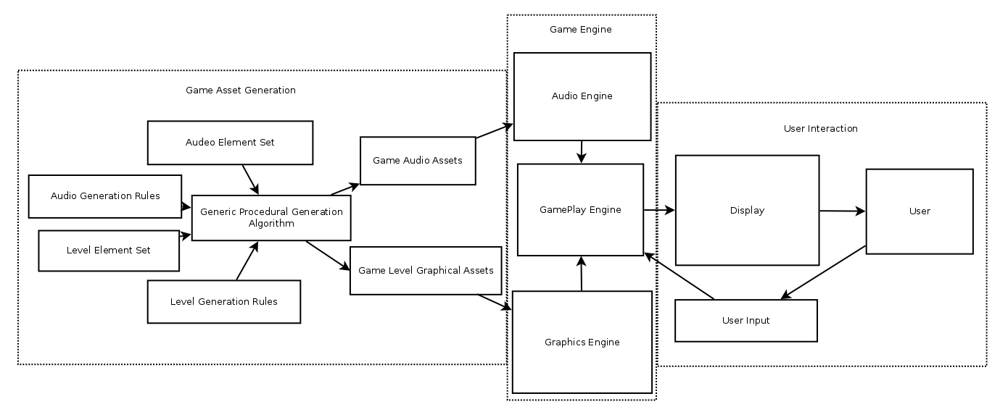

# FP7-webpage LambdaVania

##Authors
Wesley Nuzzo

David Benoit

##Overview
LambdaVania is a 2D sidescroller game, in the vein of the Metroidvania/Igavania style of games. The music for the game, and to some extent the level design, is procedurally generated (level layout is currently one-dimensional).

##Screenshot


##Concepts Demonstrated

* **Higher order procedures** such as map and foldl/foldr to convert lists of notes into rsounds, and consolidate multiple rsounds into a single rsound.
	* Map and foldl/foldr are also used to implement level graphics via a tiling system.
* **Abstraction** of sounds as musical notes.
	* There is an **abstraction barrier** between the graphics library and the actual game code, so that the means by which the graphics are loaded/produced doesn't necessarily break the game code.

<!--
Identify the OPL concepts demonstrated in your project. Be brief. A simple list and example is sufficient. 
* **Data abstraction** is used to provide access to the elements of the RSS feed.
* The objects in the OpenGL world are represented with **recursive data structures.**
* **Symbolic language processing techniques** are used in the parser.
-->

##External Technology and Libraries

Libraries used:
* rsound
* 2htdp
* racket/gui

External technology:
* GIMP to make minor edits to certain completed graphics.

<!-- Briefly describe the existing technology you utilized, and how you used it. Provide a link to that technology(ies). -->

##Favorite Scheme Expressions

####Wesley

####David

<!--
####Mark (a team member)
Each team member should identify a favorite expression or procedure, written by them, and explain what it does. Why is it your favorite? What OPL philosophy does it embody?
Remember code looks something like this:
```scheme
(map (lambda (x) (foldr compose functions)) data)
```
####Lillian (another team member)
This expression reads in a regular expression and elegantly matches it against a pre-existing hashmap....
```scheme
(let* ((expr (convert-to-regexp (read-line my-in-port)))
             (matches (flatten
                       (hash-map *words*
                                 (lambda (key value)
                                   (if (regexp-match expr key) key '()))))))
  matches)
```
-->

##Additional Remarks
<!-- Anything else you want to say in your report. Can rename or remove this section. -->

#How to Download and Run
Gameplay/Sprite Frame Animation Demo
* cd to project root dir and exec "racket run-game.racket"

<!--
You may want to link to your latest release for easy downloading by people (such as Mark).

Include what file to run, what to do with that file, how to interact with the app when its running, etc. 
-->


<!-- Previous version of README
### Gameplay Screenshot


### Dependencies:
* rsound
* 2htdp

### To Run:
Gameplay/Sprite Frame Animation Demo
* cd to project root dir and exec "racket run-game.racket"

### Statement
* Describe your project. 
	* A Procedurally generated 2D Sidescroller/ Platformer Game
* Why is it interesting? 
	* Many elements of the game including both graphics and audio will be psuedo-randomly procedurally generated.
* Why is it interesting to you personally? 
	* (Wesley) I've tried my hand at game design in the past, but have yet to make a full game. This is an opportunity for me to create a complete game while also learning & experimenting with a new design technique.
	* (David) I have a background in music/audio composition, and I am also an hobbyist gamer.  I've been interested in procedural generation of music for a while.  This project will allow me to explore all of these areas.  
* What do you hope to learn? 
	* Real-world applications of functional programming concepts.
	* How some of Racket's sound, graphics, and gaming libraries work.
	* How procedural generation works in videogames.

### Analysis

Procedural generation requires recursion/iteration as content is generally created one piece at a time, with the content of future pieces partially dependent on that of previous pieces.
An object-oriented approach will be useful for representing information about individual characters and physical objects in the scene, among other things.

During the audio generation process, audio will be represented as lists of notes.  Map and Reduce will be used to convert lists of notes into rsounds, and consolidate multiple rsounds into a single rsound.

Digital Audio is both resource-heavy and unintuitive to think about musically.  As such, it will be abstracted as music notes and sound effects.

### Data set or other source materials

The visuals will require external files containing the relevent images. These can be created in GIMP/ Inkscape or using one of Racket's image libraries.
The audio may require audio samples of some sort.

### Deliverable and Demonstration
* We will have a playable 2D game to demonstrate at the end of the project.  
* If given a specific seed, it should always generate the same level layout and audio for that seed.

### Evaluation of Results
* We will be able to measure our success by ensuring:
	* User input causes the sprite to move correctly
	* All areas of procedurally generated levels are accessable by the sprite
	* Procedurally generated audio is smooth and plays at the correct times. 
	
### Architecture Diagram

Game Engine
* Audio Engine
	* Organizes game audio assets and provides an interface to them for the Gameplay Engine.  Responsible for music and sound effects.
* Graphics Engine
	* Organizes game level graphical assets and provides an interface to them for the Gameplay Engine. Responsible for level setup and sprite animation.
* Gameplay Engine
	* Coordinates graphical and audio elements.
	* Handles user input.
Game Asset Generation
* Audio Element Set
	* The set of all audio elements that can be used in in the game
* Audio Generation Rules
	* A Set of functions to determine how to generate the audio
* Level Element Set
	* The set of all graphical level elements that can be used in in the game
* Level Generation Rules
	* A Set of functions to determine how to generate the graphical level elements
* Game Audio Assets
	* The organized subset of audio elements that will be used by the audio engine
* Game Level Graphical Assets
	* The organized subset of graphical elements that will be used by the graphics engine

	
User Interaction
* User
	* The player of the game.  Not included in product distribution.
* Display
	* The game window, to which the game will be displayed.  
	* The physical audio the game produces
* User input
	* Specific keypresses from the user which cause the game to react


## Schedule

### First Milestone (Fri Apr 15)
* Basic Assets and Gameplay
	* Interactive sprite animation
	* Audio Assets
* Basic procedural generation tests.

Progress so far:
* Built a small framework for intuitive music programming
* Created a basic audio generator that generates atonal music in an 8-bit style
* Created a level generator that generates levels randomly in one dimension
* Created a representation for sprite art that can be used to create the image files

Changes we are making:
* Rather than a generic procedural generation driver function, Audio and Level-Design procedural generation algorithms will be developed separately.

### Second Milestone (Fri Apr 22)
* Apply procedural generation algorithm to level design/ audio.

Update: New Goals
* Add rules of tonal harmony to audio generator
* Add sound effects
* Create main character sprite animations
* Add level art
* Implement basic gameplay

Progress so far:
* Created tonal harmony rsound interface
* Added tonal harmony elements to audio generator
* Updated game assets
* Created racket asset editor to help create better assets
* Created main character sprite animations
* Implemented basic gameplay (character moves based on user input)

### Final Presentation (last week of semester)
* Merge procedurally generated level elements with main game
* Merge enemy animations with main game
* Embellishments
	* Storyline
	* Boss battles
	* Add more instruments
	* Add more chord progressions
* Testing

## Group Responsibilities

### Wesley Nuzzo
* Character sprite designs
* Implementation of sprite animations
* Level design, i.e.
	* Background and foreground art
	* Procedural generation code for level layout
* Dialogue

### David Benoit
* Design audio elements
	* Sound Effects
	* Music
* Game physics (gravity, collision)
* Psuedo-random procedural generation of audio 
-->
